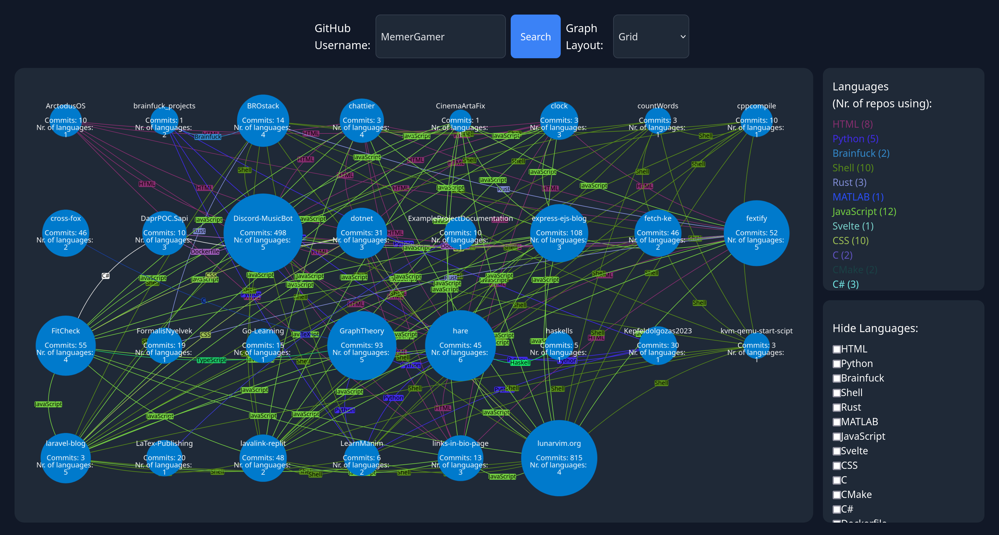

# Github Repo Visualizer

The goal of this project is to visualize github repositories in a graph and the connection between them.
Each node in the graph represents a repository and each edge represents a language used in the repository.

This should represent a users personal expertise, and their favored technologies.

Start project manually:

1. Make sure to set the `.env` variables based on the example in `.env.example`
2. Run `deno install`
3. Run `deno task dev`
